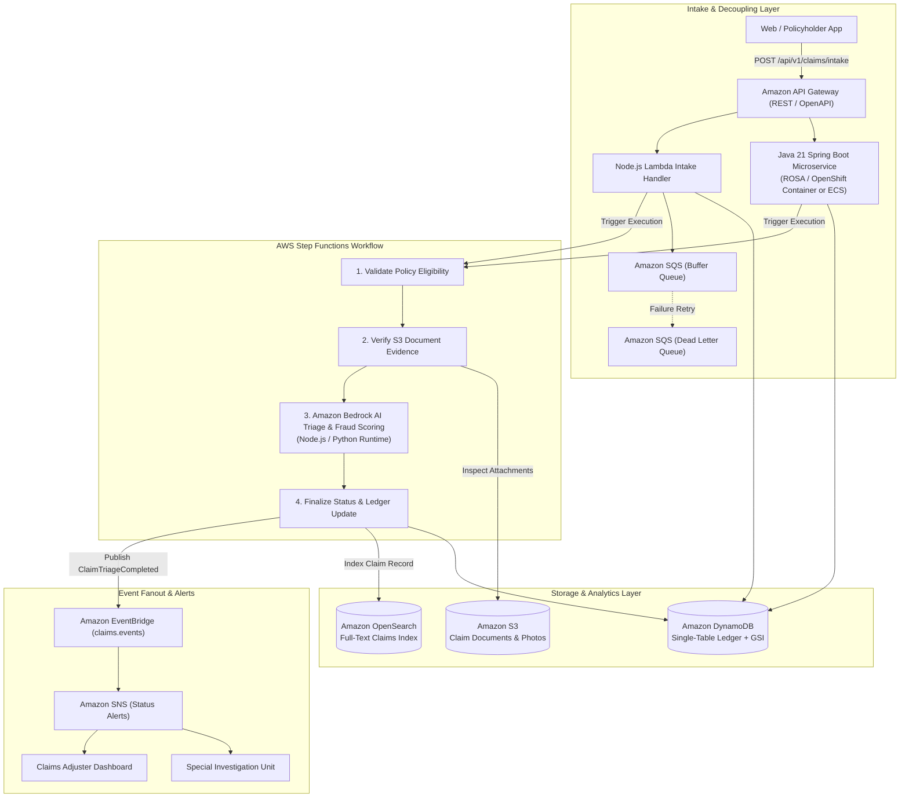

# AWS Serverless Claims Orchestration Pipeline

[](https://github.com/awanish5101/aws-serverless-claims-orchestrator/actions)
[](https://openjdk.org/)
[](https://spring.io/projects/spring-boot)
[](https://nodejs.org/)
[](https://www.terraform.io/)
[](https://www.python.org/downloads/)
[](https://aws.amazon.com/step-functions/)
[](https://aws.amazon.com/bedrock/)

An enterprise event-driven serverless claims processing and document orchestration architecture built on AWS. Designed for insurance and financial services carriers, this pipeline automates First Notice of Loss (FNOL) intake, policy validation, document attachment processing, AI triage via Amazon Bedrock, and status event fanout across Amazon EventBridge and SNS.

The repository provides polyglot backend microservice implementations across **Java 21 (Spring Boot with OpenAPI/Swagger)**, **Node.js (AWS SDK v3 Lambda handlers)**, and **Python (FastAPI & Moto test harness)**, orchestrated by **AWS Step Functions** and provisioned via modular **Terraform** Infrastructure as Code.

---

## Architecture Overview



---

## Multi-Runtime Implementation Stack

| Layer | Runtime / Framework | AWS Integration | Location |
|---|---|---|---|
| **Java Microservice** | Java 21, Spring Boot 3.2, Springdoc OpenAPI 3.0 | DynamoDB, Step Functions, EventBridge (AWS Java SDK v2) | [`java-claims-service/`](java-claims-service/) |
| **Node.js Handlers** | Node.js 20+ (ES Modules), Jest | `@aws-sdk/client-bedrock-runtime`, `@aws-sdk/client-dynamodb`, `@aws-sdk/client-eventbridge`, `@aws-sdk/client-sns` | [`nodejs-handlers/`](nodejs-handlers/) |
| **Python Handlers** | Python 3.11, Pydantic v2, Pytest, Moto | `boto3` Step Functions, DynamoDB, Bedrock, SQS, EventBridge | [`src/handlers/`](src/handlers/) |
| **Infrastructure (IaC)** | HashiCorp Terraform 1.5+ | DynamoDB Single-Table, S3, EventBridge Bus, SQS DLQ, SNS, Step Functions ASL, IAM Least Privilege | [`terraform/`](terraform/) |
| **Workflow State Machine** | Amazon States Language (ASL) | Distributed State Machine with exponential backoff retries and DLQ routing | [`statemachine/`](statemachine/) |

---

## Core Capabilities & AWS Services

### 1. Java 21 Spring Boot REST Service with OpenAPI (ROSA / OpenShift Ready)
* Provides standardized enterprise REST endpoints: `POST /api/v1/claims/intake` and `GET /api/v1/claims/health`.
* Interactive OpenAPI Swagger 3.0 UI rendered at `/swagger-ui.html` for contract-first schema validation.
* Direct integration via AWS Java SDK v2 using `DynamoDbClient` and `SfnClient` with IAM role authentication.
* Container-ready architecture designed for deployment on Red Hat OpenShift Service on AWS (ROSA) or Amazon ECS.

### 2. High-Throughput Node.js Lambda Handlers
* Lightweight ES Module handlers leveraging AWS SDK v3 modular clients for sub-100ms cold starts.
* **Intake Handler (`intakeHandler.js`):** Validates FNOL payload, registers record in DynamoDB, and starts Step Functions execution.
* **Bedrock Triage Handler (`triageBedrockHandler.js`):** Invokes Anthropic Claude 3 on Amazon Bedrock runtime with fraud heuristic evaluation.
* **Event Publisher (`eventPublisher.js`):** Dispatches domain events to EventBridge custom bus and broadcasts alerts to SNS topic.

### 3. Distributed Orchestration with AWS Step Functions
* Multi-step state machine declared in Amazon States Language (ASL).
* Coordinates policy verification, document validation against S3, Bedrock AI evaluation, and settlement.
* Handles transient errors with automated exponential backoff and error catchers.

### 4. Single-Table Ledger on Amazon DynamoDB
* Partition Key: `PK = CLAIM#{claim_id}`
* Sort Key: `SK = METADATA`
* Global Secondary Index: `GSI1PK = POLICY#{policy_number}` | `GSI1SK = STATUS#{status}`
* Ensures sub-10ms point reads and real-time indexed lookups by policy number.

### 5. Modular Infrastructure as Code (Terraform)
* Production-grade Terraform modules with strict separation of concerns:
  * DynamoDB single-table with Point-In-Time Recovery (PITR) and Streams.
  * Encrypted S3 bucket with public access block and server-side KMS encryption.
  * EventBridge custom bus, rules, and SQS/SNS integration.
  * Step Functions state machine with least-privilege IAM execution roles.

---

## Directory Structure

```text
aws-serverless-claims-orchestrator/
├── .github/
│   └── workflows/
│       └── ci.yml                     # Multi-runtime CI: Node Jest, Java Maven, Python Pytest, Terraform fmt
├── java-claims-service/               # Java 21 Spring Boot REST Service with OpenAPI
│   ├── pom.xml                        # Maven build configuration with AWS Java SDK v2
│   ├── src/main/java/com/cbre/claims/
│   │   ├── ClaimsServiceApplication.java
│   │   ├── config/AwsConfig.java      # AWS SDK v2 beans & OpenAPI info
│   │   ├── controller/ClaimsController.java # REST endpoints with OpenAPI annotations
│   │   ├── model/ClaimRequest.java    # Jakarta validation DTO
│   │   ├── model/ClaimResponse.java   # Response schema
│   │   └── service/ClaimsOrchestratorService.java # DynamoDB & Step Functions integration
│   ├── src/main/resources/application.yml
│   └── src/test/java/com/cbre/claims/
│       └── ClaimsControllerTest.java  # MockMvc integration tests
├── nodejs-handlers/                   # Node.js 20+ AWS Lambda Handlers
│   ├── package.json
│   ├── src/
│   │   ├── intakeHandler.js           # REST FNOL intake handler
│   │   ├── triageBedrockHandler.js    # Amazon Bedrock AI fraud & triage handler
│   │   └── eventPublisher.js          # EventBridge & SNS publisher
│   └── tests/
│       ├── intakeHandler.test.js      # Jest unit test
│       ├── triageBedrockHandler.test.js # Bedrock unit test
│       └── eventPublisher.test.js     # EventBridge & SNS test
├── src/                               # Python Handlers & Domain Services
│   ├── handlers/
│   │   ├── intake_handler.py
│   │   ├── validation_handler.py
│   │   ├── document_handler.py
│   │   ├── triage_handler.py
│   │   └── settlement_handler.py
│   ├── models/claim.py
│   └── services/
├── statemachine/
│   └── claims_workflow.asl.json       # Amazon States Language definition
├── terraform/
│   ├── main.tf
│   ├── dynamodb.tf
│   ├── eventbridge_sqs_sns.tf
│   ├── step_functions.tf
│   ├── variables.tf
│   └── outputs.tf
├── tests/                             # Python Pytest Test Suite
│   ├── conftest.py                    # Moto AWS mock fixtures
│   ├── test_bedrock_service.py
│   ├── test_dynamodb_service.py
│   ├── test_eventbridge_sns.py
│   ├── test_intake_handler.py
│   └── test_step_functions_pipeline.py
├── Dockerfile                         # Container image
├── docker-compose.yml
├── pytest.ini
├── requirements.txt
└── .env.example
```

---

## Test Execution Across Runtimes

### 1. Java 21 Spring Boot Microservice Tests
```bash
cd java-claims-service
mvn clean test
```
*Output: 3 passing tests validating OpenAPI health check, FNOL payload validation, and Step Functions execution mocking.*

### 2. Node.js Lambda Handlers Tests
```bash
cd nodejs-handlers
npm install
npm test
```
*Output: 3 test suites, 6 passing tests validating REST intake, Bedrock Claude 3 invocations, and EventBridge event publication.*

### 3. Python Handlers & Pipeline Tests
```bash
python3 -m venv venv
source venv/bin/activate
pip install -r requirements.txt
pytest tests/ -v
```
*Output: 11 passing tests across DynamoDB single-table CRUD, EventBridge fanout, SQS DLQ behavior, and end-to-end Step Functions execution.*

### 4. Terraform Validation
```bash
cd terraform
terraform fmt -check
```

---

## Example Claim Payload

```json
{
  "policy_number": "POL-98765432",
  "insured_name": "Paul",
  "claim_type": "AUTO",
  "incident_date": "2026-09-25",
  "incident_location": "Delhi",
  "incident_description": "Rear-ended at traffic signal. Front bumper cracked and radiator leaking.",
  "estimated_damage_amount": 4200.0,
  "documents": [
    {
      "document_id": "DOC-101",
      "s3_bucket": "serverless-claims-documents-prod",
      "s3_key": "claims/photos/bumper_damage.jpg",
      "file_type": "image/jpeg",
      "file_size_bytes": 1048576,
      "uploaded_at": "2026-09-25T14:30:00Z"
    }
  ]
}
```

---

## License

This project is licensed under the MIT License.
